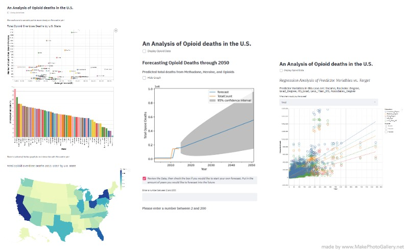

# An Analysis of Opioid Deaths in the U.S.

## Overview

We set out to help a user better understand the opioid crisis in the United States and forecast what it might look like in the future based on past indicators. We found that the most impactful way of communicating the opioid crisis was through showing what the worst case-scenario is for a lot of drug abusers, which is death from drug overdose. We analyzed a dataset that consisted of the number of drug overdose deaths broken down by 50 U.S. states, socio-economic factors and spanned over a time period of 7 years (2011-2018). We found our dataset on Kaggle and it included 1,048,575 rows. The information in the dataset was derived from the census and cdc websites. 

Upon beginning our Interactive Visualization journey, we decided to divide the project work historically, Sammy worked on the exploratory visualizations under the Exploratory Data Analysis tab. Sammy designed the choropleth and the interaction plots to represent the historical data and represent the interesting relationships therein. Taylor was responsible for building the predictive models. She designed a multivariate regression with 58% predictive power, and a forecasting time series plot, that also offered the user the option of inputting their own forecast years. In total people-hours, we spent 80 hours on this project divided equally across the two of us. 

The aspect that took Sammy the most time was plotting the Choropleth Map considering there was minimal documentation on it and very few questions about it on websites like stackoverflow. Fortunately, Sammy was able to visualize it by bringing in specific ‘number IDs’ for each state that correlated to the vega database for plotting these U.S. maps. Overall, the project took Sammy about 35-40 hours between thinking about the problem, finding the dataset, transforming the dataset, thinking about the visualizations, learning Altair and Streamlit, plotting the visualizations and debugging. 

The aspect that took Taylor the most time was the time series analysis model. It was the first skill she’d learned as an emerging data scientist in early 2018 and was therefore extremely rusty on the topic. Additionally, she’d only ever configured time series plots in R, which is much more intuitively configured for such analysis than Python is. Between training the time series model, then learning how to predict future dates with it, and finally, plotting to streamlit. This portion took much of her total project time. In all, she spent over 40 hours on the project. 

## Show Exploratory Analysis Tab

Given that the dataset was broken down by state, we found it very beneficial to create a Choropleth Map as a way to provide a simple way of showing which parts of the country suffered the most or least from the opioid crisis.

We also wanted to help the user discover if there were any relationships between drug overdose deaths and socio-economic factors like income or unemployment rate for each state. Choosing the correct visualization here was a little less straightforward than the Choropleth Map. We considered a time series plot with ‘total deaths’ on the y-axis, ‘years’ on the x-axis and the data points being each individual U.S. state. However, upon attempting this, we realized the amount of U.S. states (50) was excessive for a standard time series, which has a line for each state. The visualization would have been too crowded and would confuse the user rather than help enable him or her to answer the question. Another suggestion was a standard bar chart where each state was represented by one bar and the y-axis as the total deaths. It was a step in the right direction, but too simple for our purposes as a stand-a-lone visualization. This is where we came to the decision of creating a scatter plot visualization, where similar to the time-series  we have the states plotted as data points and the y-axis as the total overdose deaths, but what we did different here was instead of plotting the the time on the x-axis, we used a slider widget to control what year was being displayed on the chart. Here the x-axis was flexible for us to experiment with different attributes like the socio-economic we mentioned previously. 

We found income to be the most interesting attribute over a period of time. This visualization alone enabled us to look at the opioid crisis data through four different dimensions (state, deaths, income, and year) unlike your typical chart which generally contains two to three dimensions. We also added the ability to zoom and pan because it was needed given the amount of states plotted on that chart. In addition to that, we enabled text for each data point highlighting which state it was before the user even hovered over it to see the details about that data point. We found those interactive elements crucial in order to easily digest this visualization that has four different dimensions to it. 

We didn’t end it there because we found other opportunities to provide deeper insight on the opioid crisis. One way we went about that was taking the aforementioned bar chart, but instead of using the y-axis to display total drug overdose deaths, we used unemployment rate, another socioeconomic factor with an interest to compare it with our four dimensional visualization. To do this we implemented a selection interval on the bar chart and depending what states we highlighted on the bar chart, it highlighted the same states on the four dimensional plot. This gave us insight into the relationship between unemployment rate, income and total overdose deaths while being able to filter the data using the year slider.

All of these visualizations present a solid understanding about who is affected the most by the opioid crisis from a socio-economic stand-point and from a geographical stand-point. 

## Regression Analysis Tab 

Once we’d established our exploratory data analysis tab, we moved on to predictive modeling. We started by analyzing the distribution of the continuous variables to determine normalcy. None of the variables looked normal upon first review. We then used the Shapiro-Wilk test to retrieve the statistic and p-values. The p-value and statistics revealed that none of the variables maintained a normal distribution. We then used boxcox to transform the data to more closely align with a normal distribution. After adjusting this, we looked into the correlation between variables and the target (total opioid deaths). We found what looked to be positive correlations. These necessitated further analysis, which was done with an analysis of the rho and p values from spearman’s correlation coefficient. These results showed that only income and education variables correlated with opioid deaths. 

We then replaced Nan values across the dataset with the median of each respective variable. The data was then divided into testing and training datasets. Finally, we created the linear regression with the training variables and used the model to predict the test dataset. The model was then evaluated with the regression score, which showed that the model was able to accurately predict 58% of the time. This information fueled our creation of the linear regression tab on our app. 

This tab plots education count colored by education type, with income as the size feature, across total counts of opioid deaths by county. This plot also allows the user to select the drug they want to further analyze the results. There are currently no packages capable of plotting multivariate regression without dimensionality reduction. This was a concern as dimensionality reduction would greatly reduce the interpretability, and this is not reasonable for an interactive visualization. 

For this reason, we determined that the best way to represent our findings was to plot each of the predictor variables against the total opioid deaths, then we added a regression line to allow the user to see how each variable was trending. 

## Forecasting Tab

For the time series analysis portion, we divided the training dataset and testing dataset with a cut off of 2014. This was the mid-point in the data, as it runs from 2011 to 2017. We then trained the time series with Auto Regressive Moving Average. This gave much better results than a simple moving average, or exponential smoothing time series model, and was thus selected above the other model choices. 

Once this was plotted, we used the predict feature to predict 50 years into the future. We then determined that the best way to offer interactivity to the user, was to allow the user to create their own forecast. We decided this was the method because simply zooming into a line chart or selecting points on the line chart didn’t add enough interest to the visualization, whereas this option allows the user to explore the data in an exciting and user-driven way. 

## Conclusion

Ultimately, we determined that the best question to ask for this data set and to explore was “what is the history of the opioid crisis? what will it look like in the future and how can we best predict this future?”

The goals we explored throughout the project were: 
  1. Create a map representation of this state opioid death tolls to represent which states have the most concentrated deaths?
  2. Create a scatter plot that will show the relationship between socioeconomic status and opioid deaths across the past as well as use these variables to predict future deaths 
  3. Above all else, allow users to draw their own conclusions from an exploratory app

 We created an application that was divided into three tabs, each of which allow the user to interact with the visualizations and determine which factors are contributing to the opioid death tolls. We added features throughout that would capture a user’s interest in the data itself for its own sake. 
